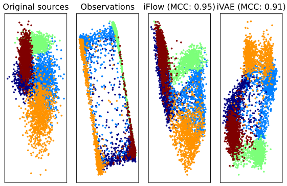
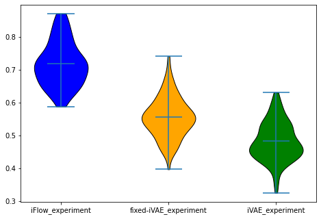

# Reproducibility challenge PapersWithCode: iFlow, ICLR2020.

This repository is the a re-implementation of [Identifying through Flows for Recovering Latent Representations](https://arxiv.org/abs/1909.12555). 
With source code used from the [official repository](https://github.com/MathsXDC/iFlow).

## Requirements
This repository uses anaconda for environment management and pytorch for machine learning.   

To install and use the cpu environment used in our experiments do:
```
conda env create -f environment.yml
conda activate iFlow
```
For precise reproducability a nvidia 1080 Ti is needed with cuda version 10.1 and cudnn version 7.6
To install and use the cuda environement used in our experiments do:
```
conda env create -f environment-cuda.yml
conda activate iFlow-cuda
```

## Training
To train a iFlow model, run this command from the iFlow directory:

```train
cd iFlow
./scripts/run_iFlow.sh
```

A more comprehensive overview is given in the jupyter notebook results.ipynb. Here the exact configurations used in our reproducibility paper.
```results
cd iFlow
jupyter notebook
```
## Evaluation

All plots used in the paper can be reproduced and configured in the notebook "results.ipynb".

## Pre-trained Models

Two models for every experiment (seed 1 & 2) are present in the repository to quickly test things.

## Results
What the different models do (iFlow & iVAE-fixed):  


How the different models perform:  


